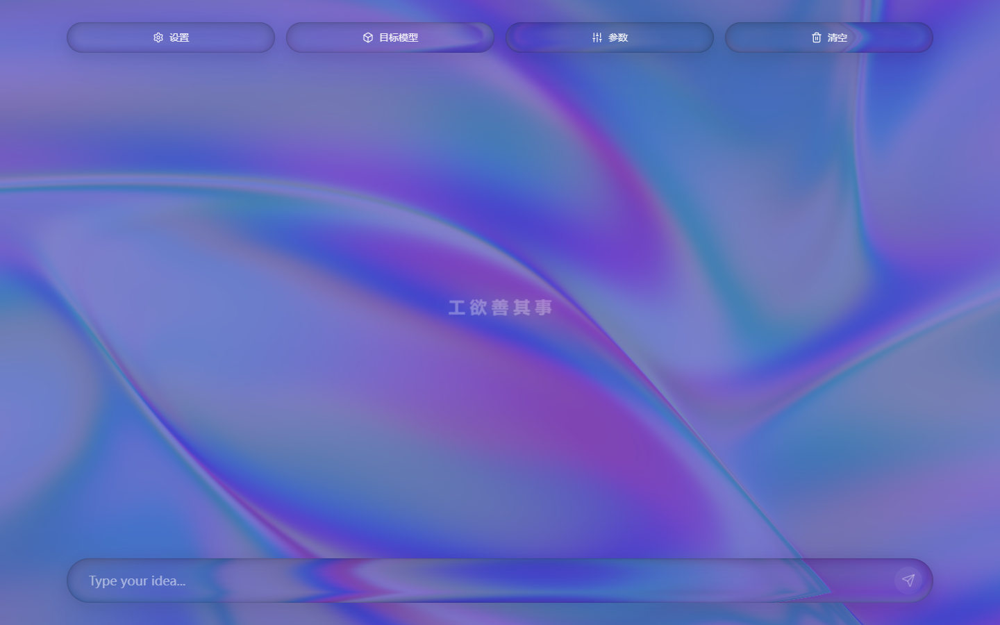
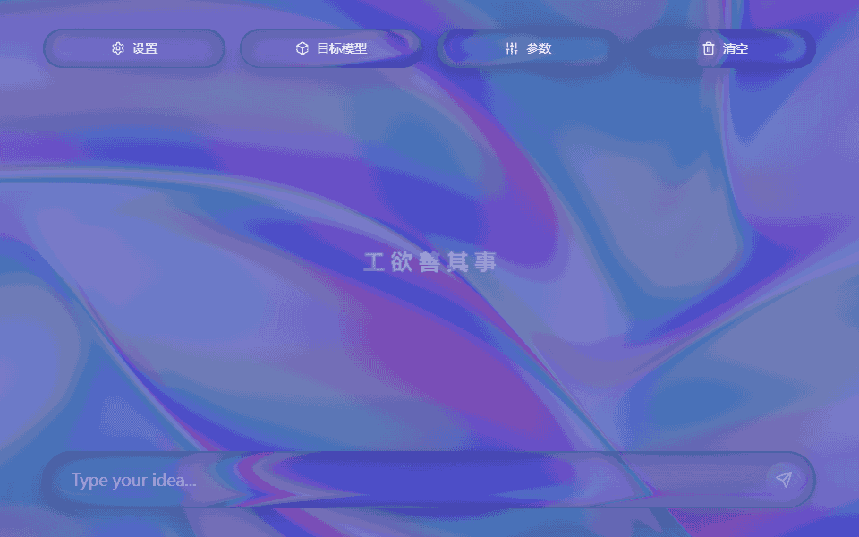
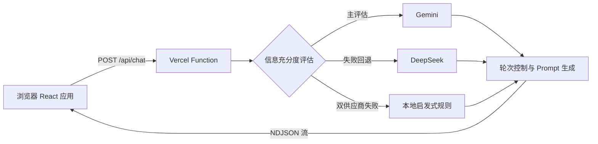

<div align="center">

# ✨ PromptStudio

**通过启发式对话，把模糊想法逐步整理成可直接使用的高质量 Prompt。**

[](https://react.dev/)
[](https://www.typescriptlang.org/)
[](https://vite.dev/)
[](https://vercel.com/)

[🚀 在线体验](https://kmk-s-prompt-studio.vercel.app) · [🛠️ 本地运行](#️-本地运行) · [☁️ 部署到-vercel](#️-部署到-vercel)

</div>

## 🖼️ 运行画面



<div align="center">
  
</div>

## 🌟 核心功能

- 🧭 **启发式需求探索**：每轮只确认一个关键维度，逐步补全目标、受众、上下文、输出规格、约束和验收标准。
- 🎯 **面向目标模型适配**：为 ChatGPT、Gemini、Grok、Manus 的特点和任务模式组织最终 Prompt。
- 🧠 **模型充分度评估**：Gemini 负责主评估，失败时由 DeepSeek 接管；两者均不可用时使用本地规则保证流程不中断。
- 💬 **流式对话体验**：通过 NDJSON 持续显示生成内容，保留可点击选项、静默提交和错误恢复体验。
- 📋 **最终 Prompt 一键复制**：完成信息收集后，在消息气泡中展示一次结构化 Prompt，并提供复制按钮。
- 🎨 **玻璃拟态主题**：支持多种动态背景配色，桌面端与移动端使用同一套响应式界面。
- 🔐 **服务端密钥保护**：供应商 Key 仅存在于 Vercel Functions 环境变量中，不会进入浏览器包。

## 🤖 目标模型与任务模式

“目标模型”表示最终 Prompt 要交给哪个 AI 使用，并不代表当前负责生成 Prompt 的供应商。

| 目标模型 | 可选任务模式 |
| --- | --- |
| ChatGPT | 深度研究、图片生成、深入推理 |
| Gemini | 深度研究、图片生成、文本撰写 |
| Grok | 深究真相、图片生成、人物设定 |
| Manus | 深度研究、程序开发、制作报告 |

生成引擎固定采用 **Gemini 主用、DeepSeek 故障回退**，前端不提供供应商切换入口。

## 🧩 工作原理



一次正常对话轮次包括：

1. 浏览器提交会话历史和目标模型参数，不提交任何 API Key。
2. 服务端判断六个需求维度是否已经得到有效说明。
3. 轮次状态机结合追问强度，决定继续询问一个问题或生成最终 Prompt。
4. Gemini 流式生成回复；仅在首个输出前出现超时、限流或供应商 5xx 时回退 DeepSeek。
5. 服务端解析 `UI_META` 与 `FINAL_PROMPT`，再以 NDJSON 事件发送给浏览器。

> 💡 模型充分度评估发生在生成之前，因此正常情况下每轮包含一次评估调用和一次生成调用。

## 🏗️ 项目结构

```text
PromptStudio/
├─ api/
│  └─ chat.ts                 # Vercel Function、供应商路由和 NDJSON 输出
├─ docs/images/               # README 运行截图与演示动图
├─ src/
│  ├─ components/             # 玻璃拟态、动态背景和模型菜单组件
│  ├─ services/
│  │  ├─ chatService.ts       # 浏览器流式请求客户端
│  │  └─ geminiService.ts     # 系统提示词、轮次控制和协议解析
│  ├─ App.tsx                 # 聊天界面与交互状态
│  ├─ index.css               # Tailwind CSS 与全局样式
│  └─ types.ts                # 目标模型与任务模式
├─ .env.example               # 服务端环境变量示例
├─ index.html
├─ package.json
└─ vite.config.ts
```

## 🛠️ 本地运行

### 环境要求

- [Node.js](https://nodejs.org/) 20 或更高版本
- npm
- 至少一个可用的 Gemini 或 DeepSeek API Key；推荐同时配置两者

### 1. 安装依赖

```bash
npm install
```

### 2. 配置环境变量

复制示例文件：

```bash
cp .env.example .env.local
```

Windows PowerShell：

```powershell
Copy-Item .env.example .env.local
```

然后填写服务端 Key：

```dotenv
GEMINI_API_KEY="your-gemini-api-key"
DEEPSEEK_API_KEY="your-deepseek-api-key"
```

> 🔒 不要为这些变量添加 `VITE_` 前缀。带有该前缀的值会被 Vite 暴露给浏览器。

### 3. 启动完整应用

PromptStudio 同时依赖 Vite 页面和 `/api/chat` Vercel Function，因此请使用：

```bash
npx vercel dev
```

首次运行时，Vercel CLI 可能要求登录并关联项目。启动完成后，根据终端提示访问本地地址。

只需要查看前端布局时，也可以运行 `npm run dev`；该模式不会启动聊天接口。

### 常用命令

| 命令 | 用途 |
| --- | --- |
| `npm run dev` | 启动 Vite 前端开发服务器 |
| `npx vercel dev` | 启动页面与 Vercel Function 的完整本地环境 |
| `npm run lint` | 运行 TypeScript 静态检查 |
| `npm run build` | 构建生产客户端 |
| `npm run preview` | 本地预览已经构建的客户端 |
| `npm run clean` | 跨平台删除 `dist` 构建目录 |

## 🔌 接口与流协议

`POST /api/chat` 接收以下数据：

```ts
type ChatRequest = {
  messages: Array<{ role: 'user' | 'assistant'; content: string }>;
  targetModel: 'ChatGPT' | 'Gemini' | 'Grok' | 'Manus';
  mode: string;
  temperature: number;
  intensity: number;
  detailLevel: number;
};
```

响应类型为 `application/x-ndjson`，每行是一个独立 JSON 事件：

```ts
{ type: 'text', text: string }
{ type: 'ui', ui: { options?, finalPrompt?, readyToGenerate? } }
{ type: 'done', provider: 'gemini' | 'deepseek' }
{ type: 'error', code: string, message: string, retryable: boolean }
```

请求会校验模型、任务模式、参数范围、消息数量、单条长度及总内容长度。错误响应不会包含供应商正文、完整用户 Prompt 或 API Key。

## ☁️ 部署到 Vercel

1. 将仓库导入 [Vercel](https://vercel.com/)。框架选择 Vite，保留默认构建设置。
2. 在 Project Settings → Environment Variables 中添加：
   - `GEMINI_API_KEY`
   - `DEEPSEEK_API_KEY`
3. 同时勾选 Preview 与 Production 环境，然后重新部署。
4. 先在功能分支 Preview 中完成一次完整对话，再合并到 `main` 发布生产版本。

也可以使用 Vercel CLI：

```bash
vercel link
vercel env pull
vercel                 # Preview Deployment
vercel --prod          # Production Deployment
```

### 🧱 防火墙建议

当前项目为 `POST /api/chat` 配置按 IP 固定窗口限流：

- 时间窗口：60 秒
- 最大请求数：20
- 维度：客户端 IP
- 超限响应：HTTP 429

限流可以降低误用和自动化滥用风险，但不等同于登录或身份鉴权。

## 🔐 安全说明

- API Key 只从 Vercel Functions 的服务端环境变量读取。
- 请求体中的 `apiKey`、`deepseekApiKey` 会被直接拒绝。
- 日志只记录供应商、状态、耗时、是否回退和充分度结果，不记录完整对话。
- `.env*` 已被 Git 忽略，只有不含真实凭据的 `.env.example` 可以提交。
- 如果 Key 曾进入公开前端构建或 Git 历史，应立即轮换并吊销旧 Key。
- 公开访问的应用仍可能产生模型调用费用，请保留防火墙与供应商额度告警。

## 🧯 常见问题

### 页面正常，但发送消息提示接口不存在

通常是因为只运行了 `npm run dev`。请改用 `npx vercel dev`，让 `/api/chat` 与前端一起启动。

### 提示“生成服务尚未完成配置”

确认 `.env.local` 或 Vercel 环境变量中至少存在一个有效 Key，并在修改线上变量后重新部署。

### Gemini 不可用时会怎样？

充分度评估会尝试 DeepSeek；生成阶段仅在 Gemini 尚未输出任何内容且发生可回退错误时切换 DeepSeek。已经开始输出后不会重新生成整段回答。

### 为什么模型还在继续追问？

参数面板中的追问强度决定最少和最多轮次。即使信息已经充分，未达到最少轮次时仍会再确认一个关键问题。

### README 动图为什么没有声音？

演示使用轻量 GIF，专注展示交互路径，不包含音频、个人数据或真实凭据。

## 🗺️ 后续计划

- 🧪 补充自动化单元测试、接口测试与端到端测试。
- ♿ 完善键盘操作、焦点状态和无障碍说明。
- 📊 增加不记录 Prompt 正文的匿名运行指标与成本观察。
- 🌍 根据需要补充英文文档与多语言界面。

---

<div align="center">

Made with 💜 for clearer prompts and better AI conversations.

</div>
